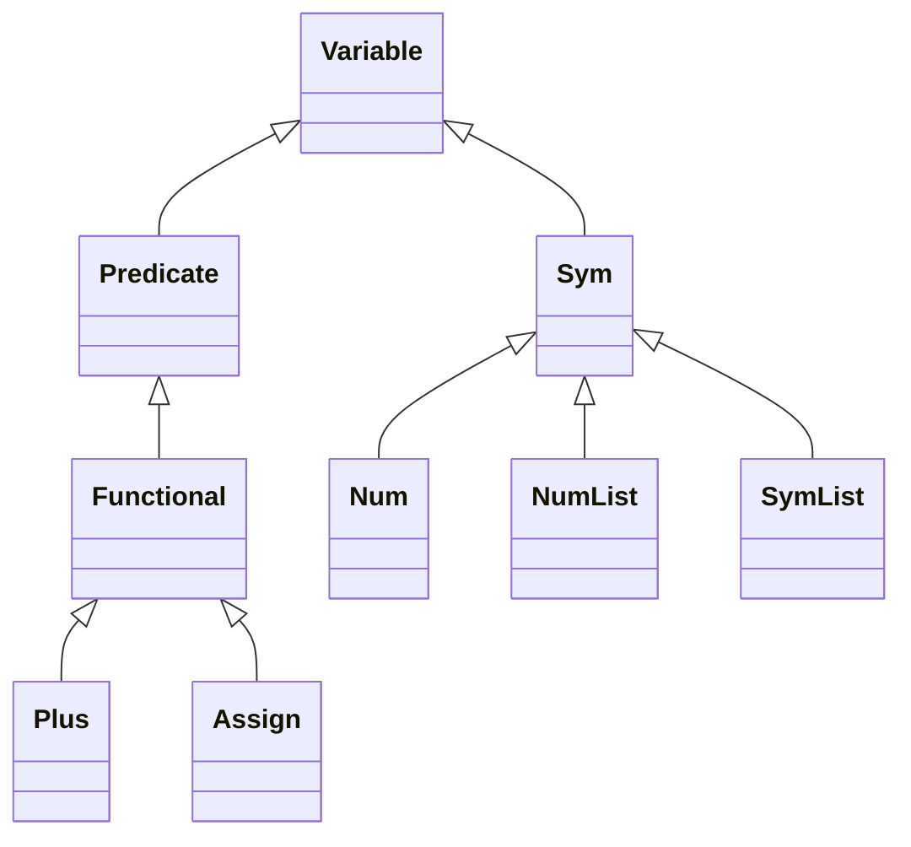

# Unification

Unification is one of the main components of inductive logic programming. Although it is not required directly in query execution, substitution based variable aligning for query content and query results are practically use the code block of unification. On the other hand, unification is used in answer set programming and modifying the database dynamically by using queries.

```scala  
val p1 = Parser.parsePredicate("p(f(X,Y),f(Z,Z)).").get 
val p2 = Parser.parsePredicate("p(f(f(W,Z),V), W).").get    
val result = Unification().of(p1, p2) println("p1 : " + p1) 
println("p2 : " + p2) 
println("Result : " + result.get)  
```  

A code block is given for recursive unification of p1, and p2. Both predicates and the unification assignment are given below.

```bash  
p1 : p(f(X,Y),f(Z,Z))  
p2 : p(f(f(W,Z),V),W)  
Result : {W <- f, V <- Y, X <- f}  
```  

Here the result is represented by Substitution class and it contains one to one mapping of variables and their values. It can be seen that there are only distinct variables in the final result. So no repetitions are allowed. The unification result unifies the variable with predicate f, the variable of V with Y and finally the X variable in p1 will be f. When substitution is found, it can be applied to any predicate. An example is given as follows.

```scala  
//Substitution: {W <- f, V <- Y, X <- f}  
val substitution = result.get 
val gg = Parser.parsePredicate("g(W, X, V).").get 
println(gg) 
println(gg.substitution(substitution))  
``` The bash output of this code snippet is given below. So W, X, and V variables are assigned to their new values.  
  
```bash  
g(W,X,V)  
g(f(Z,Z),f(W,Z),Y)  
```  

# Functional Predicates

Another important building blog of inductive logic programming is functional predicates. These predicates are actual functions that requires a symbol input to be processes. An example functional predicate is Plus (X1=X1+1) predicate. This predicate sums two numbers and assigns the value to the result.  Plus predicate is given below.

```scala  
class Plus(result:Variable, var1: Variable, var2:Variable) extends Functional("plus", Array(var1, var2, result)):    
    
  //Tests whether the predicate is ready to be executed.  
 override def isExecutable(): Boolean = isDefinite()  
 //If both inputs are symbols then the result can be computed.  
 override def isDefinite(): Boolean = var1.isNumber() && var2.isNumber()  
 override def getVariables(): Array[Variable] = array.filter(variable=> variable.isVariable())    
  //Returns the result as  Num symbol.  
 override def getValue(): Variable = {    
		val total = var1.asNumber().getNumber() + var2.asNumber().getNumber()    
    Num(result.getName(), total)    
 }    
    
  override def getInput(): Array[Variable] = Array(var1, var2)    
    
  override def hasInput(variable: Variable): Boolean = {    
    val name = variable.getName()    
    name == var1.getName() || name == var2.getName()    
  }    
    
  override def hasInput(position: Int): Boolean = position == 0 || position==1    
    
  //Only substitutes the input variables.  
 override def substitution(substitution: Substitution): Variable = {    
	 val var1new = var1.substitution(substitution)    
   val var2new = var2.substitution(substitution)    
   Plus(result, var1new, var2new)    
  }    
  //Computes the result and return the output variable as a substitution.  
 override def execute(): Option[Substitution] =    Some(Substitution(result, getValue()))    
    
  override def toString: String = result.getName() + " is " + var1 + "+" + var2  
```

# Variables

First of all in **SiLP**, predicates, symbols, lists, and numbers are all variable types. The numbers are represented by Num, symbols are represented by Sym, and lists are presented by NumList. Elements of the NumList are double numbers.  The class diagram of all the variable types are given as below.


The content of a NumList class  is given below.

```scala
 //NumList is derived from Sym class. 
 //It contains double numbers 
class NumList(n:String, var items:Array[Double]) extends Sym(n, items.mkString(",")) :  
  
  def this(name:String) = this(name, Array[Double]())  
  def this(name:String, var1:Double) = this(name, Array(var1))  
  def this(name:String, var1:Double, var2:Double) = this(name, Array(var1, var2))  
  def this(name:String, var1:Double, var2:Double, var3:Double) = this(name, Array(var1, var2, var3))  
 
	  
	override def isNumberList(): Boolean = true  
	override def isSymbol(): Boolean = true  
	override def getSize():Int = items.size  
	override def isEmpty(): Boolean = items.isEmpty  
	override def copy(): Variable = NumList(name, items)  
  
  override def substitution(substitution: Substitution): Variable = {  
    val targetValue = substitution.valueByVariable(this)  
    if targetValue.isDefined && targetValue.get.isNumberList() then targetValue.get  
    else  this  
  }  
  
  override def id(): Int = items.foldRight(name.hashCode){case(crr, main)=> main * 7 + crr.hashCode()}  
  
  def nonEmpty() : Boolean = items.nonEmpty  
  def getHead(): Num = Num("X", items.head)  
  def append(num:Num): NumList = NumList(name, items:+num.getNumber())  
  def prepend(num:Num): NumList = NumList(name, num.getNumber() +: items)  
  def reverse(): NumList = NumList(name, items.reverse)  

  def getTail(): NumList = NumList(name, items.tail)  
  def getTail(name:String): NumList = NumList(name, items.tail)  
  
  def average() : Num = Num(name, items.sum/items.length)  
  def sum() : Num = Num(name, items.sum)  
  def log(): NumList =  
    NumList(name, items.map(item => math.log(item)))  
  
  override def hashCode(): Int = name.hashCode()  
  
  override def equalValue(variable: Variable): Boolean =  
  
    if variable.isNumberList() then  
		  val other = variable.asNumList()  
      other.getSize() == items.length && other.items.zip(items).forall(pair => pair._1 == pair._2)  
    else  
		  val otherName = variable.getName()  
      otherName == name  
  
  override def equals(compare: Any): Boolean = {  
    val variable = compare.asInstanceOf[Variable]  
    if variable.isNumberList() then  
       val other = variable.asNumList()  
      other.getName() == name && other.getSize() == items.length && 
      other.items.zip(items).forall(pair=> pair._1 == pair._2)  
    else  
      val otherName = variable.getName()  
      otherName == name  
  }  
  
  override def toString: String = items.mkString("[",",","]")
```


    

